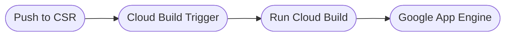

# EcoSense App API

## Introduction
A RESTful API built with ExpressJS and TypeScript for CRUD operation.\
This is the back-end for EcoSense capstone project, which is included in the Bangkit Academy 2022 program.

## Technologies

## Endpoints for Android
- [x] `GET` `/campaigns`
  - [x] `GET` `/campaigns?q={<string>}`
  - [x] `GET` `/campaigns?categoryId={<int>}`
  - [x] `GET` `/campaigns?q={<string>}&categoryId={<int>}`
- [x] `GET` `/dashboard`
- [x] `GET` `/categories/?campaignId={<int>}`
- [x] `GET` `/detail`
- [x] `GET` `/contributions`
- [x] `POST` `/proof`
- [x] `POST` `/completecampaign`
- [x] `POST` `/joincampaign`

## Endpoints for Web
- [x] `GET` `/trendingCampaigns`
- [x] `POST` `/loginToWeb`
- [x] `POST` `/addNewCampaign`
- [x] `GET` `/myCampaigns`

## Try the API
To get the most trending campaigns, you can try to access [this link](https://ecosense-bangkit.uc.r.appspot.com/trendingCampaigns).

## Google Cloud Platform Infrastructure
- Cloud Source Repositories `ecosense-restapi:main`
- Cloud Build
- Cloud Build Trigger `ecosense-restapi`
- Google App Engine 
  - Service `default`
  - Latest Version `20220527t075709` (May 27, 2022)
- Google Cloud Storage 
  - Bucket for Campaign Posters `ecosense-campaign-posters`
  - Bucket for Task Completion Proof `ecosense-task-proofs`

## 
&#169; EcoSense 2022.